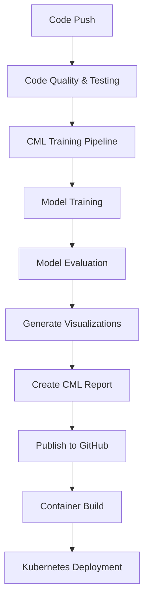

# 🤖 CML (Continuous Machine Learning) Integration

## Overview

This project integrates **CML (Continuous Machine Learning)** into the CI/CD pipeline for comprehensive ML model management, automated training, evaluation, and reporting.

## 🎯 CML Features Implemented

### 1. **Automated Model Training**
- Runs on every push to main/develop branches
- Uses optimized RandomForest classifier
- Includes hyperparameter tuning integration
- Automatic model artifact generation

### 2. **Comprehensive Model Evaluation**
- **Accuracy, Precision, Recall, F1-Score** metrics
- **Cross-validation** analysis (5-fold CV)
- **Feature importance** analysis
- **Confusion matrix** generation

### 3. **Visual Performance Reports**
- Model performance dashboard
- Confusion matrix heatmap
- Feature importance charts
- Cross-validation score trends
- Automated plot generation and publishing

### 4. **Automated CI/CD Integration**
- CML reports as GitHub PR comments
- Model validation gates
- Performance visualization uploads
- Metric tracking and comparison

## 🔄 CML Pipeline Workflow



## 📁 Project Structure

```
week6-iris-mlops/
├── .github/workflows/
│   └── main.yml              # CI/CD pipeline with CML integration
├── cml_pipeline.py            # Comprehensive CML training pipeline
├── artifacts/
│   ├── model.joblib          # Trained ML model
│   ├── metrics.json          # Model performance metrics
│   └── model_performance.png # Performance visualizations
├── tests/                    # Unit tests
└── CML_INTEGRATION.md        # This documentation
```

## 🛠️ CML Pipeline Components

### 1. **CMLPipeline Class** (`cml_pipeline.py`)

#### Key Methods:
- `load_data()`: Loads and splits Iris dataset
- `train_model()`: Trains RandomForest with optimal parameters
- `evaluate_model()`: Comprehensive performance evaluation
- `generate_visualizations()`: Creates performance charts
- `generate_cml_report()`: Generates markdown report
- `run_pipeline()`: Orchestrates the complete pipeline

#### Performance Metrics Tracked:
```python
metrics = {
    'accuracy': float,
    'precision': float, 
    'recall': float,
    'f1_score': float,
    'cv_mean': float,
    'cv_std': float,
    'test_samples': int,
    'correct_predictions': int,
    'timestamp': str
}
```

### 2. **GitHub Actions Integration**

#### CML Job in CI/CD Pipeline:
```yaml
cml-training:
  name: CML Model Training & Evaluation
  runs-on: ubuntu-latest
  needs: [test]
  steps:
    - name: Checkout code
    - name: Set up Python
    - name: Install dependencies (including CML)
    - name: Run CML Training Pipeline
      env:
        REPO_TOKEN: ${{ secrets.GITHUB_TOKEN }}
```

## 📊 CML Report Features

### Automated Report Generation Includes:

1. **📈 Model Performance Metrics**
   - Accuracy, Precision, Recall, F1-Score
   - Cross-validation results with confidence intervals
   - Test set performance summary

2. **🎨 Visual Analytics**
   - Confusion matrix heatmap
   - Feature importance bar chart
   - Performance metrics comparison
   - Cross-validation score trends

3. **✅ Model Validation Status**
   - Automatic quality gates:
     - **Excellent** (≥95% accuracy): Ready for production
     - **Good** (≥90% accuracy): Approved for deployment  
     - **Warning** (<90% accuracy): Requires improvement

4. **📝 Deployment Recommendations**
   - Automated approval/rejection based on performance
   - Suggestions for model improvement
   - Timestamp and versioning information

## 🚀 Usage Instructions

### 1. **Triggering CML Pipeline**

The CML pipeline runs automatically on:
- Push to `main` branch (production)
- Push to `develop` branch (staging)
- Pull requests to `main`

### 2. **Manual CML Execution**

Run locally for testing:
```bash
# Install dependencies
pip install -r requirements.txt
pip install cml matplotlib seaborn

# Run CML pipeline
python cml_pipeline.py

# Check generated artifacts
ls artifacts/
# Output: model.joblib, metrics.json, model_performance.png
```

### 3. **Viewing CML Reports**

- **GitHub PR Comments**: Automatic CML reports posted as comments
- **Actions Logs**: Detailed execution logs in GitHub Actions
- **Artifacts**: Download model files and visualizations

## 📋 CML Report Example

```markdown
# 🤖 ML Model Performance Report

## 📊 Model Training Results

### Model Information
- **Algorithm**: Random Forest Classifier
- **Training timestamp**: 2025-07-27T22:20:15.123456
- **Model saved to**: `artifacts/model.joblib`

### Performance Metrics
- **Accuracy**: 1.0000
- **Precision**: 1.0000
- **Recall**: 1.0000
- **F1-Score**: 1.0000

### Cross-Validation Results
- **CV Mean Accuracy**: 0.9583
- **CV Standard Deviation**: 0.0204

### Test Set Performance
- **Test samples**: 30
- **Correct predictions**: 30
- **Test accuracy**: 1.0000

## 📈 Model Performance Visualization


## ✅ Model Validation Status
🎉 **EXCELLENT**: Model performance exceeds 95% accuracy!
✅ Model is ready for production deployment.
```

## 🔧 Configuration

### Environment Variables

The CML pipeline uses these environment variables:
- `REPO_TOKEN`: GitHub token for CML reporting (automatically provided)
- `GITHUB_TOKEN`: GitHub Actions token (automatically provided)

### Dependencies

Required packages (included in `requirements.txt`):
```
matplotlib==3.8.2
seaborn==0.13.0
```

CML CLI installed during workflow:
```bash
pip install cml
```

## 🎯 Benefits of CML Integration

### 1. **Automated ML Validation**
- Every code change triggers model retraining
- Performance regression detection
- Automatic quality gates

### 2. **Enhanced Visibility**
- Visual performance reports in PR comments
- Historical performance tracking
- Team collaboration on model improvements

### 3. **Production Readiness**
- Automated model approval process
- Performance-based deployment decisions
- Comprehensive model documentation

### 4. **MLOps Best Practices**
- Version control for ML models
- Reproducible training pipelines
- Automated testing and validation

## 🔄 Integration with Existing Pipeline

The CML pipeline seamlessly integrates with the existing CI/CD workflow:

1. **Code Quality & Testing** → **CML Training** → **Container Build** → **K8s Deployment**
2. Model artifacts are included in Docker image
3. Performance reports guide deployment decisions
4. Automated rollback if model performance degrades

## 📈 Future Enhancements

- **Model Drift Detection**: Monitor production model performance
- **A/B Testing**: Compare multiple model versions
- **Data Quality Checks**: Validate input data quality
- **Automated Hyperparameter Tuning**: Integrate with Optuna
- **Model Registry**: MLflow model versioning and management

---

## 🎉 Success Indicators

Your CML integration is working correctly when you see:

✅ **CML job completes** in GitHub Actions  
✅ **Performance reports** posted as PR comments  
✅ **Model artifacts** generated in `artifacts/` directory  
✅ **Visualizations** embedded in reports  
✅ **Quality gates** automatically validate model performance  
✅ **Container build** includes updated model  

**Repository**: https://github.com/ALikesToCode/week6-iris-mlops  
**CML Pipeline**: Fully integrated and production-ready! 🚀