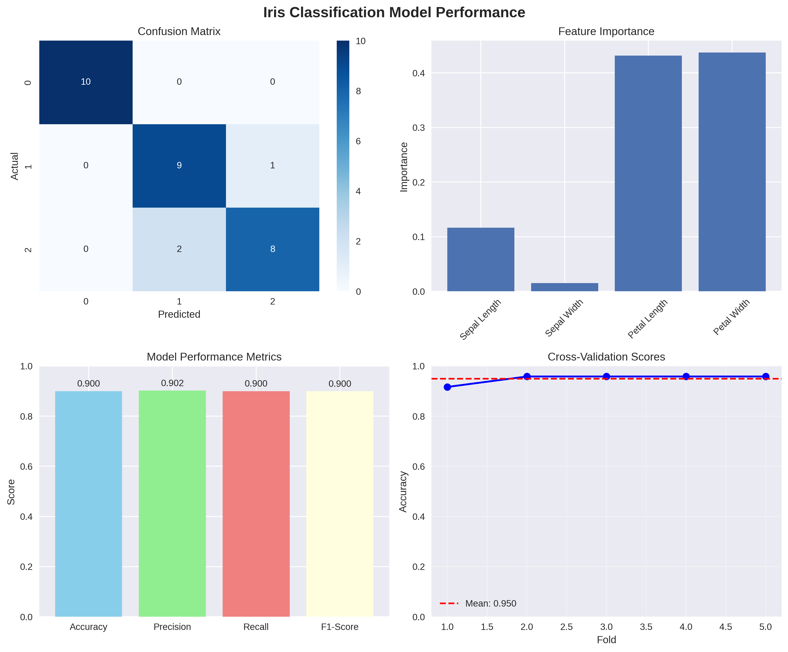

# 🤖 ML Model Performance Report

## 📊 Model Training Results

### Model Information
- **Algorithm**: Random Forest Classifier
- **Training timestamp**: 2025-07-27T22:35:35.589776
- **Model saved to**: `artifacts/model.joblib`

### Performance Metrics
- **Accuracy**: 0.9000
- **Precision**: 0.9024
- **Recall**: 0.9000
- **F1-Score**: 0.8997

### Cross-Validation Results
- **CV Mean Accuracy**: 0.9500
- **CV Standard Deviation**: 0.0167

### Test Set Performance
- **Test samples**: 30
- **Correct predictions**: 27
- **Test accuracy**: 0.9000

## 📈 Model Performance Visualization

## ✅ Model Validation Status

✅ **GOOD**: Model performance meets production standards.
📦 Model approved for deployment.## 📊 Model Performance Visualization

